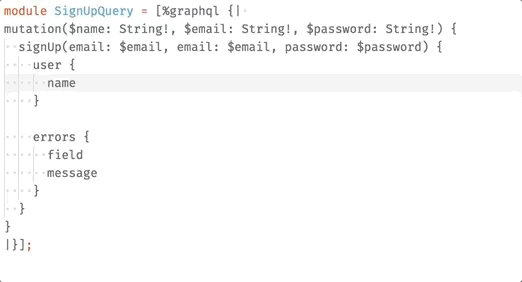
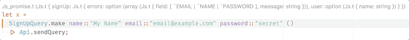
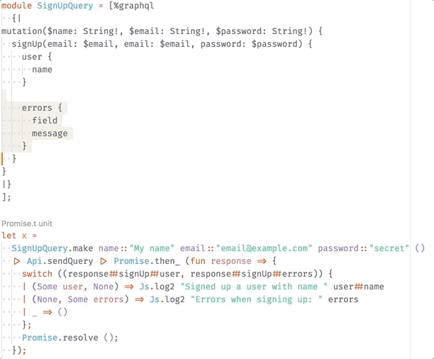

# GraphQL syntax extension for Bucklescript/ReasonML

[](https://travis-ci.org/mhallin/graphql_ppx)
[](https://ci.appveyor.com/project/mhallin/graphql-ppx)


This library lets you construct type-safe and validated queries at compile time,
and generates response validation code for you. If you're writing a
[Bucklescript](https://bucklescript.github.io/bucklescript/Manual.html) app that
talks to a [GraphQL](http://graphql.org) server, this library will cut down on
the boilerplate you have to write.

It is compatible with both OCaml and ReasonML syntax. There are no runtime
dependencies except for `Js.Json` and `Js.Dict`, both included in the
Bucklescript standard library.

## Installation

Assuming that you've already got a Bucklescript project set up, installing this
syntax extension consists of two steps:

First, add this package as a dependency to your `package.json`:

```sh
yarn add --dev graphql_ppx
# or, if you use npm:
npm install --saveDev graphql_ppx
```

Second, add the PPX to your `bsconfig.json`:

```json
{
    "ppx-flags": [
        "graphql_ppx/ppx"
    ]
}
```

## Examples

If you add a field that does not exist, you'll get a compiler error on the exact
location this happens. This automatically works with
[Merlin](https://github.com/ocaml/merlin), giving you immediate feedback in your
editor:



Variables sent to queries and mutations are of course typed too. Nullable
variables are translated to optional labelled arguments, while non-null
variables become mandatory arguments:



(The `Api.sendQuery` function here is a small wrapper around [bs-fetch](https://github.com/reasonml-community/bs-fetch), check it out below)

The result of a query is turned into a typed `Js.t` object, which will generate compiler errors if you try to access fields that don't exist:



While these examples use the [ReasonML](https://reasonml.github.io) syntax,
using the standard OCaml syntax works as well.

## Usage

### Download the server schema

This plugin requires a `graphql_schema.json` file to exist somewhere in the
project hierarchy, containing the result of sending an [introspection
query](https://github.com/graphql/graphql-js/blob/master/src/utilities/introspectionQuery.js)
to your backend. To help you with this, a simple script is included to send this
query to a server and save the result as `graphql_schema.json` in the current
directory:

```sh
yarn send-introspection-query http://my-api.example.com/api
# or, if you use npm
npm run send-introspection-query http://my-api.example.com/api
```


#### Custom schema name

If you've already got a schema file downloaded for other purposes, you can tell
graphql_ppx to use that one by updating the "ppx-flags" in `bsconfig.json`.
Note: no space around the equal sign!

```json
{
  "ppx-flags": [
    "graphql_ppx/ppx\\ -schema=your_schema.json"
  ]
}
```

While you can pass a path higher up the folder structure, like
`-schema=../somedir/your_schema.json`, you might result into some path parsing
problems with BuckleScript or Merlin.

### Ignore `.graphql_ppx_cache` in your version control

This plugin will generate a `.graphql_ppx_cache` folder alongside your JSON
schema to optimize parsing performance for BuckleScript and Merlin. If you're
using a version control system, you don't need to check it in.


### Send queries

To define a query, you declare a new module and type the query as a string
inside the `graphql` extension:

```reason
module HeroQuery = [%graphql {|
{
  hero {
    name
  }
}
|}];
```

This module exposes a few functions, but the most useful one is `make`, which
takes all arguments to the query/mutation as labelled function arguments, ending
with `()`. It an object containing three things: `query`, which is a string
containing the query itself; `variables`, a `Js.Json.t` object containing the
serialized variables for the query; and `parse`, a function that takes a
`Js.Json.t` instance and returns a typed object corresponding to the query.

A simple example might make this a bit clear:

```reason
module HeroQuery = [%graphql {| { hero { name } } |}];

/* Construct a "packaged" query; HeroQuery takes no arguments: */
let heroQuery = HeroQuery.make();

/* Send this query string to the server */
let query = heroQuery##query;

/* Let's assume that this was the result we got back from the server */
let sampleResponse = "{ \"hero\": {\"name\": \"R2-D2\"} }";

/* Convert the response to JSON and parse the result */
let result = Js.Json.parseExn(sampleResponse) |> query##parse;

/* Now you've got a well-typed object! */
Js.log("The hero of the story is " ++ result##hero##name);
```

### Integrating with the Fetch API

[bs-fetch](https://github.com/reasonml-community/bs-fetch) is a wrapper around
the Fetch API. I've been using this simple function to send/parse queries:

```reason
exception Graphql_error(string);

let sendQuery = q =>
  Bs_fetch.(
    fetchWithInit(
      "/graphql",
      RequestInit.make(
        ~method_=Post,
        ~body=
          Js.Dict.fromList([
            ("query", Js.Json.string(q##query)),
            ("variables", q##variables)
          ])
          |> Js.Json.object_
          |> Js.Json.stringify
          |> BodyInit.make,
        ~credentials=Include,
        ~headers=
          HeadersInit.makeWithArray([|("content-type", "application/json")|]),
        ()
      )
    )
    |> Js.Promise.then_(resp =>
         if (Response.ok(resp)) {
           Response.json(resp)
           |> Js.Promise.then_(data =>
                switch (Js.Json.decodeObject(data)) {
                | Some(obj) =>
                  Js.Dict.unsafeGet(obj, "data")
                  |> q##parse
                  |> Js.Promise.resolve
                | None =>
                  Js.Promise.reject(Graphql_error("Response is not an object"))
                }
              );
         } else {
           Js.Promise.reject(
             Graphql_error("Request failed: " ++ Response.statusText(resp))
           );
         }
       )
  );
```

# Features

* Objects are converted into `Js.t` objects
* Enums are converted into [polymorphic
  variants](https://realworldocaml.org/v1/en/html/variants.html)
* Floats, ints, strings, booleans, id are converted into their corresponding native
  OCaml types.
* Custom scalars are parsed as `Js.Json.t`
* Arguments with input objects
* Using `@skip` and `@include` will force non-optional fields to become
  optional.
* Unions are converted to polymorphic variants, with exhaustiveness checking.
  This only works for object types, not for unions containing interfaces.
* Interfaces are also converted into polymorphic variants. Overlapping interface
  selections and other more uncommon use cases are not yet supported.
* Basic fragment support

# Limitations

While graphql_ppx covers a large portion of the GraphQL spec, there are still
some unsupported areas:

* Not all GraphQL validations are implemented. It will *not* validate argument
  types and do other sanity-checking of the queries. The fact that a query
  compiles does not mean that it will pass server-side validation.
* Fragment support is limited and not 100% safe - because graphql_ppx only can
  perform local reasoning on queries, you can construct queries with fragments
  that are invalid.

## Extra features

By using some directives prefixed `bs`, `graphql_ppx` lets you modify how the
result of a query is parsed. All these directives will be removed from the query
at compile time, so your server doesn't have to support them.

### Record conversion

While `Js.t` objects often have their advantages, they also come with some
limitations. For example, you can't create new objects using the spread (`...`)
syntax or pattern match on their contents. Since they are not named, they also
result in quite large type error messages when there are mismatches.

OCaml records, on the other hand, can be pattern matched, created using the
spread syntax, and give nicer error messages when they mismatch. `graphql_ppx`
gives you the option to decode a field as a record using the `@bsRecord`
directive:

```reason

type hero = {
  name: string,
  height: number,
  mass: number
};

module HeroQuery = [%graphql {|
{
  hero @bsRecord {
    name
    height
    mass
  }
}
|}];
```

Note that the record has to already exist and be in scope for this to work.
`graphql_ppx` will not _create_ the record. Even though this involves some
duplication of both names and types, type errors will be generated if there are
any mismatches.

### Custom field decoders

If you've got a custom scalar, or just want to convert e.g. an integer to a
string to properly fit a record type (see above), you can use the `@bsDecoder`
directive to insert a custom function in the decoder:

```reason
module HeroQuery = [%graphql {|
{
  hero {
    name
    height @bsDecoder(fn: "string_of_float")
    mass
  }
}
|}];
```

In this example, `height` will be converted from a number to a string in the
result. Using the `fn` argument, you can specify any function literal you want.

### Non-union variant conversion

If you've got an object which in practice behave like a variant - like `signUp`
above, where you *either* get a user *or* a list of errors - you can add a
`@bsVariant` directive to the field to turn it into a polymorphic variant:

```reason
module SignUpQuery = [%graphql
  {|
mutation($name: String!, $email: String!, $password: String!) {
  signUp(email: $email, email: $email, password: $password) @bsVariant {
    user {
      name
    }

    errors {
      field
      message
    }
  }
}
|}
];

let x =
  SignUpQuery.make(~name="My name", ~email="email@example.com", ~password="secret", ())
  |> Api.sendQuery |> Promise.then_(response =>
    switch (response##signUp) {
    | `User(user) => Js.log2("Signed up a user with name ", user##name)
    | `Errors(errors) => Js.log2("Errors when signing up: ", errors)
    } |> Promise.resolve);
```

This helps with the fairly common pattern for mutations that can fail with
user-readable errors.

### Alternative `Query.make` syntax

When you define a query with variables, the `make` function will take
corresponding labelled arguments. This is convenient when constructing and
sending the queries yourself, but might be problematic when trying to abstract
over multiple queries.

For this reason, another function called `makeWithVariables` is _also_
generated. This function takes a single `Js.t` object containing all variables.

```reason
module MyQuery = [%graphql {|
  mutation ($username: String!, $password: String!) {
    ...
  }
|}];

/* You can either use `make` with labelled arguments: */
let query = MyQuery.make(~username="testUser", password="supersecret", ());

/* Or, you can use `makeWithVariables`: */
let query = MyQuery.makeWithVariables({ "username": "testUser", "password": "supersecret" });
```

### Getting the type of the parsed value

If you want to get the type of the parsed and decoded value - useful in places
where you can't use OCaml's type inference - use the `t` type of the query
module:

```reason
module MyQuery = [%graphql {| { hero { name height }} |}];


/* This is something like Js.t({ . hero: Js.t({ name: string, weight: float }) }) */
type resultType = MyQuery.t;
```

### Verbose mode (Contributors only)

You can pass `-verbose` in `bsconfig.json` to turn on the verbose mode. You can
also use the `Log` module to log into verbose mode.

## Experimental: `graphql-tag` replacement

To simplify integration with e.g. Apollo, this PPX can write the query AST
instead of the raw source, in a way that _should_ be compatible with how
[graphql-tag](https://github.com/apollographql/graphql-tag) works.

To enable this, change your `bsconfig.json` to:

```json
{
    "ppx-flags": [
        "graphql_ppx/ppx\\ -ast-out"
    ]
}
```

Now, the `query` field will be a `Js.Json.t` structure instead of a string,
ready to be sent to Apollo.

```reason
module HeroQuery = [%graphql {| { hero { name } } |}];

/* Construct a "packaged" query; HeroQuery takes no arguments: */
let heroQuery = HeroQuery.make();

/* This is no longer a string, but rather an object structure */
let query = heroQuery##query;
```

## Building manually on unsupported platforms

graphql_ppx supports 64 bit Linux, Windows, and macOS, as well as 32 bit
Windows out of the box. If you're on any other platform, please open an issue
on this repository so we can support it.
